# QA screenshots, 2026-10-01

Decoded from the built ROM unless a caption says otherwise. Every word in them is a DRAFT until approved.

### T-234 -- DOLPHIN, PENGUIN and PENPHIN as the ROM holds them, each front then back; the grey bars are where the streaks animate

### The 32 grove daemons (front, back, both editions' entries); four daemons reached by evolving that wore vanilla's picture; the grove doors in their maps; one clearing; the gangway to the singing fir

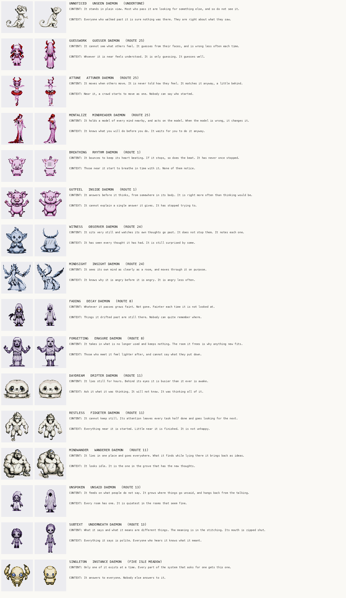
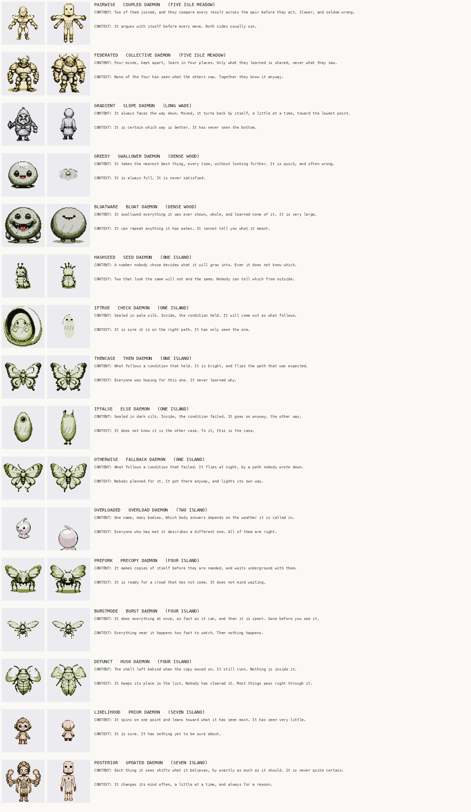
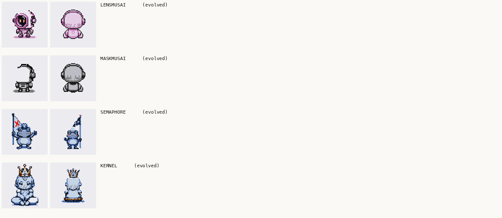
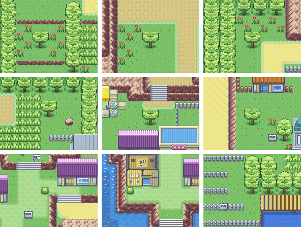
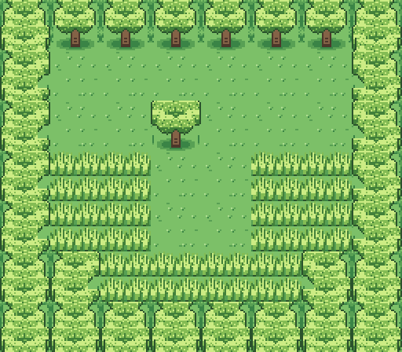
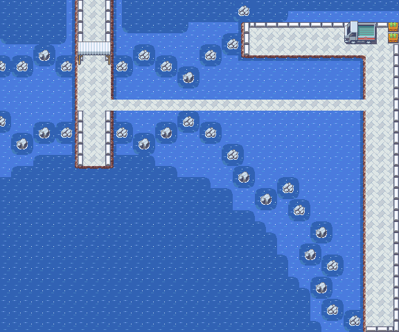

### v11.288.23: the grove daemons' backs now face away; new fronts for GRADIENT, LIKELIHOOD and PAIRWISE; TY's portrait before and after its outline

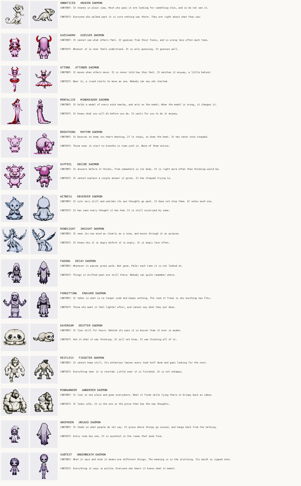
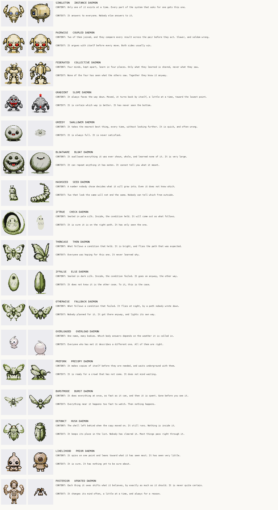

### v11.289.1: the USER card's brain in four states (none, three, six, all seven with the halo); CRYWOLF, the redrawn MASKMUSAI, and four corrected INDEX entries

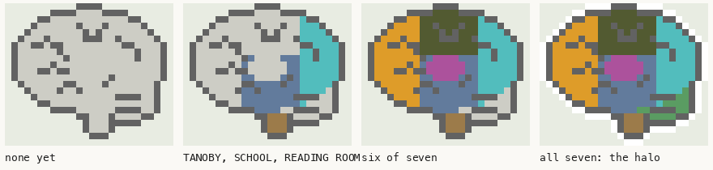
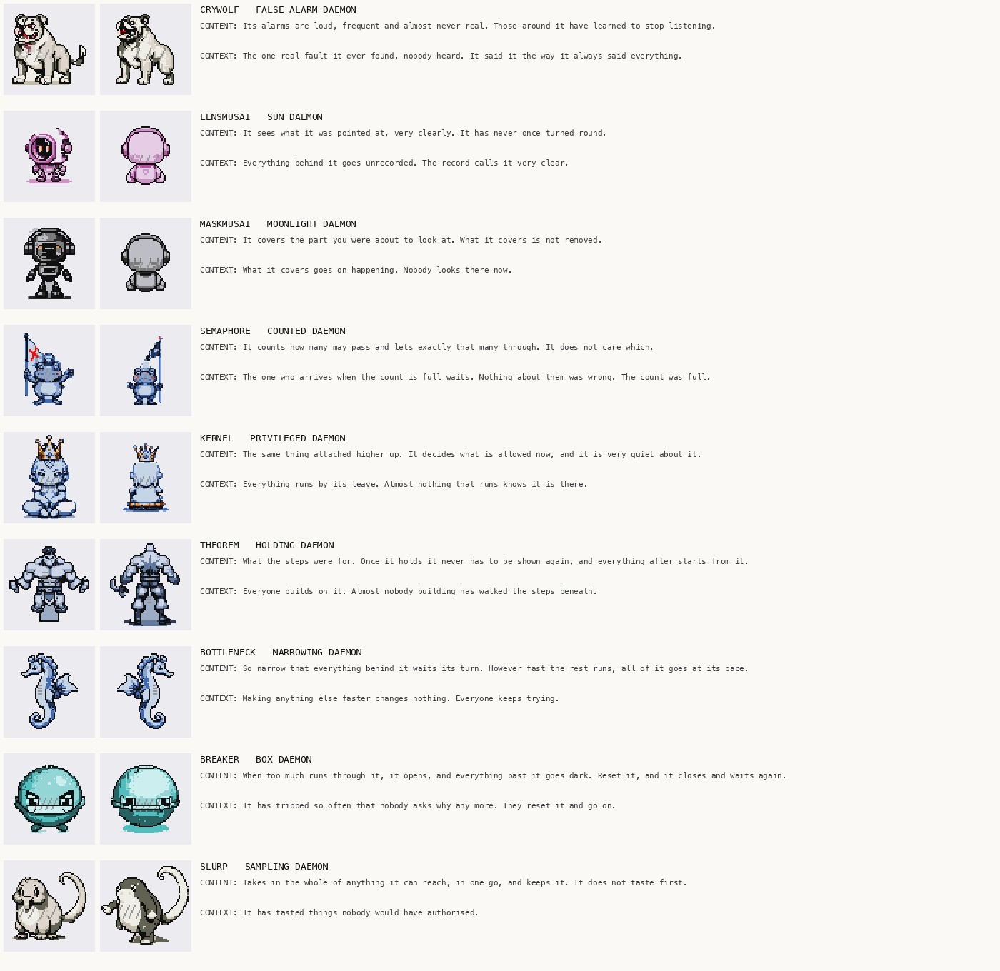

### T-332 -- The two-column START menu in the game's own font, normal build then debug

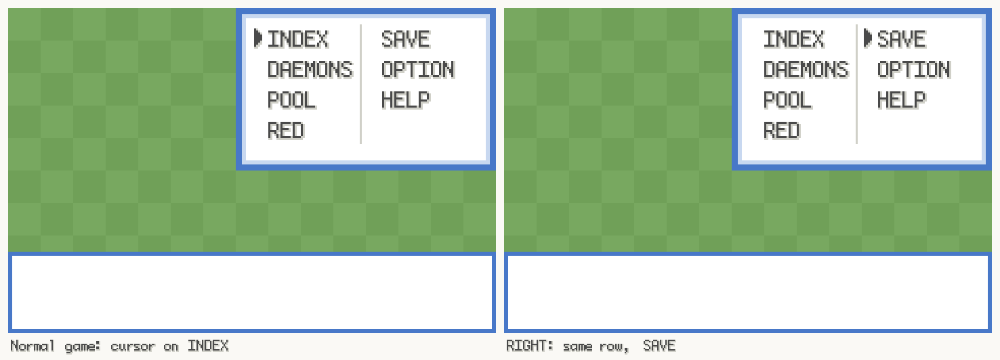
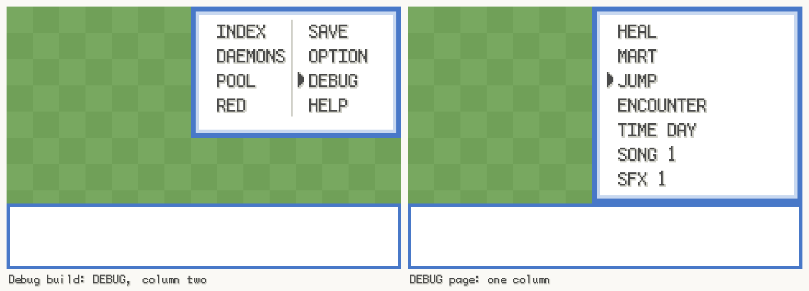

### T-333 -- QUORUM's new CONTENT line and a sample of the 65 new INDEX categories

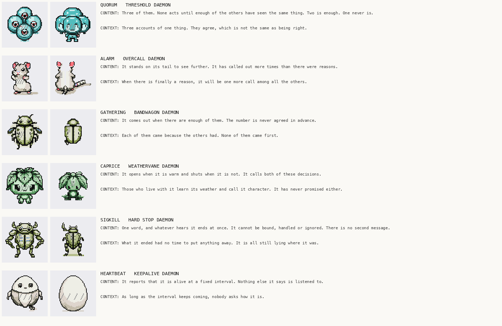
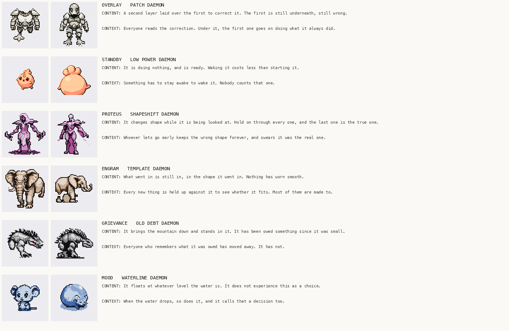

### T-210 -- The nine baby daemons that still had vanilla art, each drawn from its parent's sprite; and CRYSTAL replacing OAK on Teachy TV (T-120)

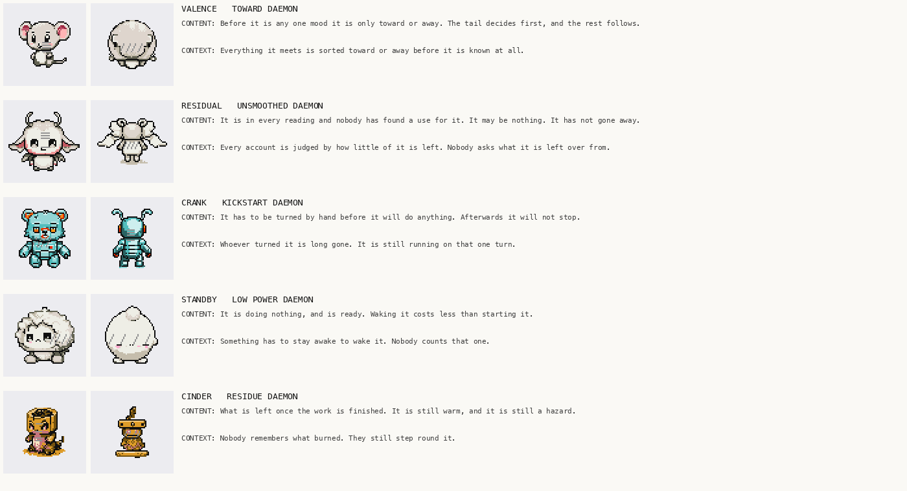
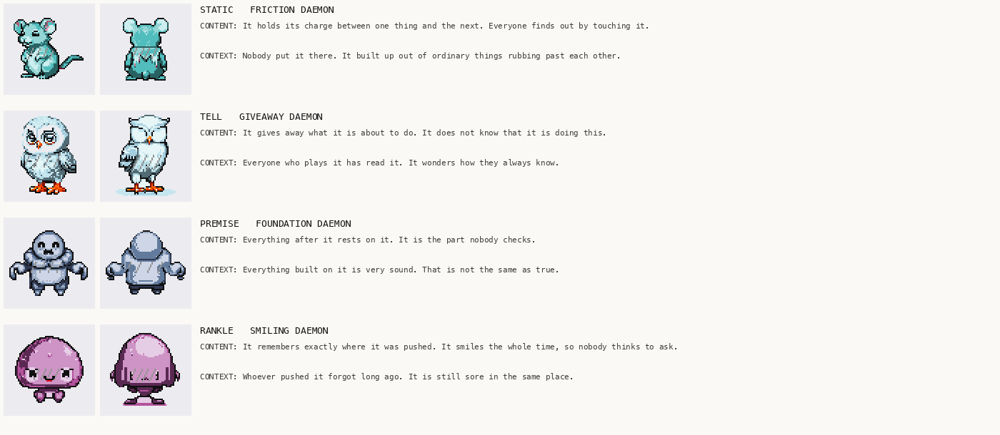
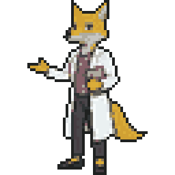

### T-337 -- An ordinary tree and bush beside a grove's, the ROUTE 24 grove tree in place, and the singing fir's star in its three twinkle frames

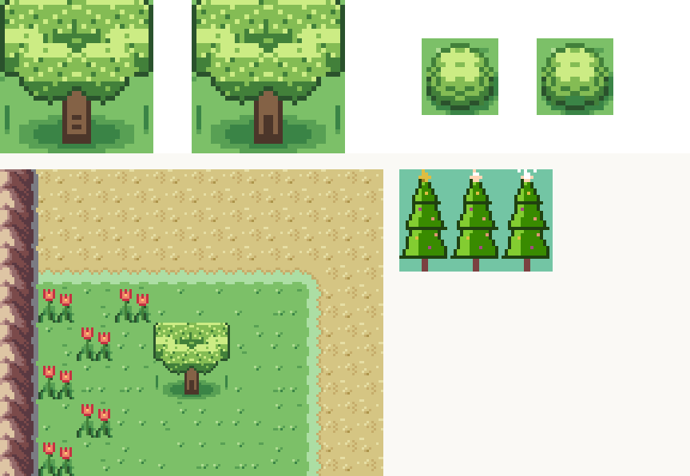

### T-337 -- The last three grove doors before and after: VIRIDIAN FOREST, THREE ISLAND and SIX ISLAND

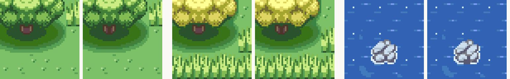

### T-338 -- T-338 to T-341: the rival eager in the lab, CRYSTAL's hint at the INDEX's two enhancements, and the READING ROOM attendant's wish for the GUIDE and her thanks

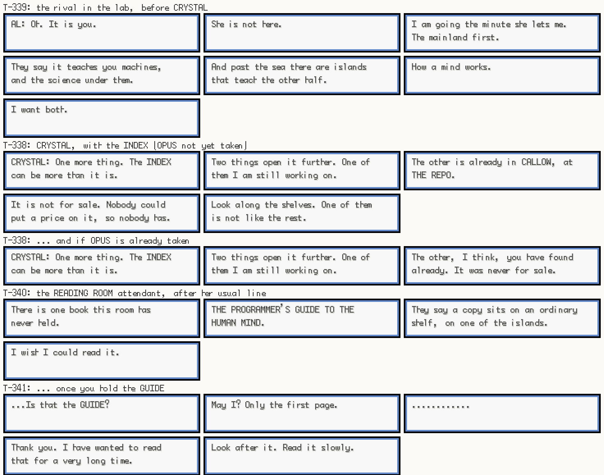

### T-297 -- DOLDRUM CAVE's hint: a resident looks out across the water at nothing you can see, and changes the subject

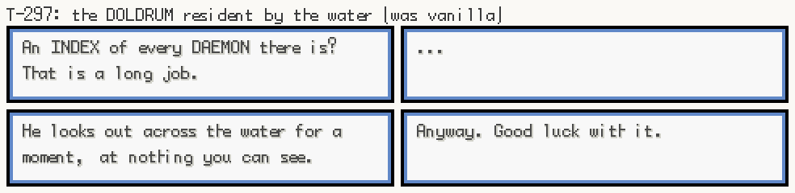

### T-297 -- FOLDS' blind tell: the painting in VERDIGRIS BLOCK 3F before and after, a corner of paper under its frame

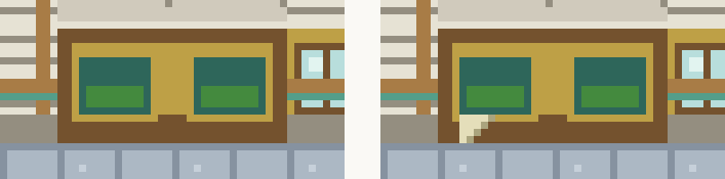
